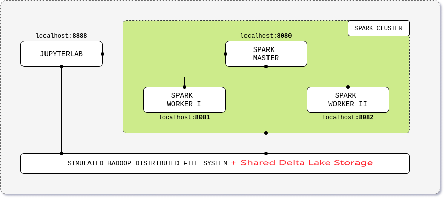

# Apache Spark Standalone Cluster on Docker + Delta Lake

## Introduction

This project was based on the work https://github.com/cluster-apps-on-docker/spark-standalone-cluster-on-docker  (> **André Perez** - [dekoperez](https://twitter.com/dekoperez) - andre.marcos.perez@gmail.com).
But here is possible to store data with Delta Lake on the shared workspace.


<p align="center"></p>


## TL;DR

```bash
curl -LO https://raw.githubusercontent.com/leofdecarvalho/spark-standalone-cluster-on-docker/master/docker-compose.yml
docker-compose up
```

See https://github.com/cluster-apps-on-docker/spark-standalone-cluster-on-docker to learn how to build or customize the image,

- Infra

| Component      | Version |
| -------------- | ------- |
| Docker Engine  | 1.13.0+ |
| Docker Compose | 1.10.0+ |

- Languages and Kernels

| Spark | Hadoop | Delta   | Python | [Python Kernel](https://ipython.org/) |
| ----- | ------ | ------- | ------ | ------------------------------------- | 
| 3.x   | 3.2    | 1.1.0   | 3.5.2  | 7.19.0                                |
| 2.x   | 2.7    | 0.7     | 3.7.3  | 7.19.0                                |

- Apps

| Component      | Version                 | Docker Tag                                           |
| -------------- | ----------------------- | ---------------------------------------------------- |
| Apache Spark   | 2.4.0 \| 2.4.4 \| 3.0.0\| 3.2.1 | **\<spark-version>**                                 |
| JupyterLab + [Sql Editor](https://github.com/CybercentreCanada/jupyterlab-sql-editor/blob/main/CONTRIBUTING.md)    | 2.1.4 \| 3.0.0 \| 3.3.2         | **\<jupyterlab-version>**-spark-**\<spark-version>** |
